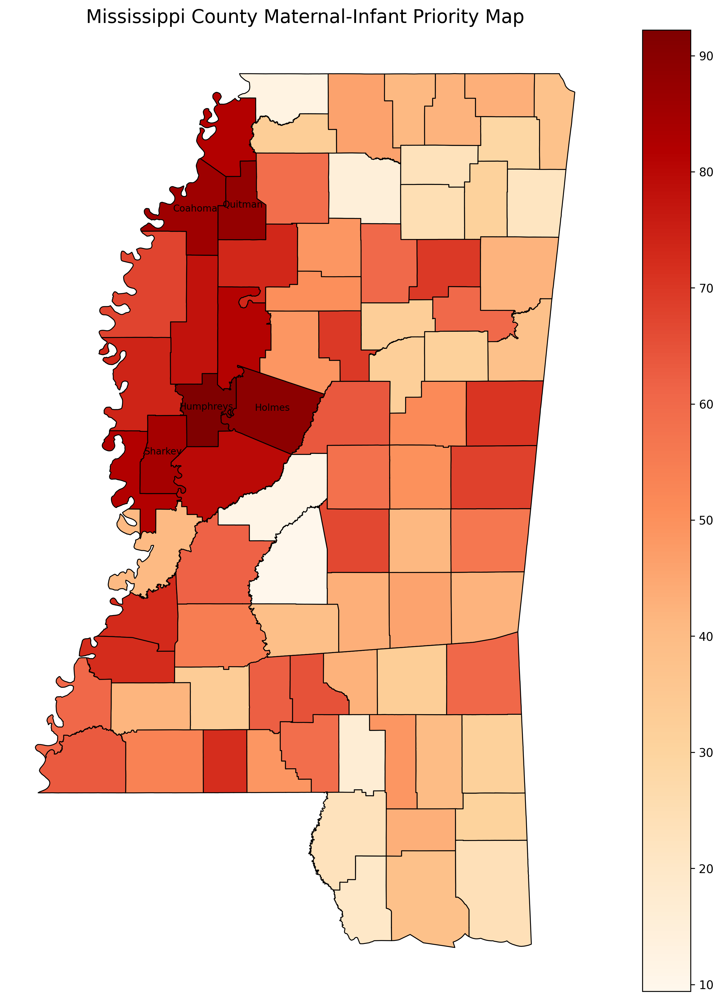
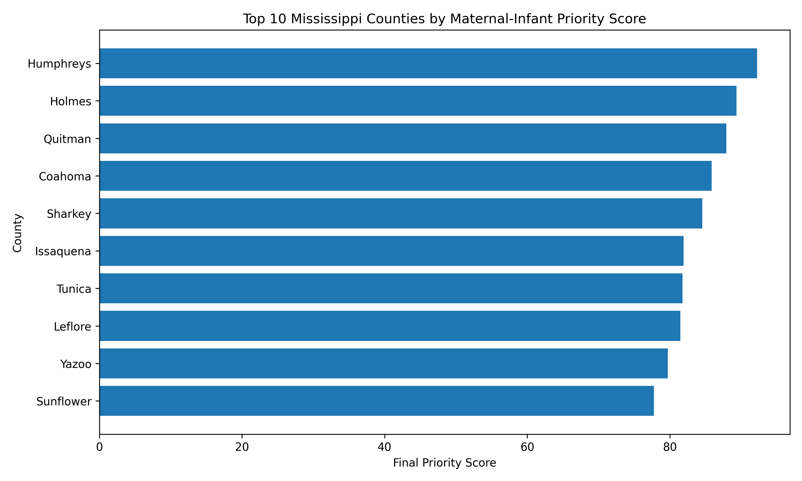
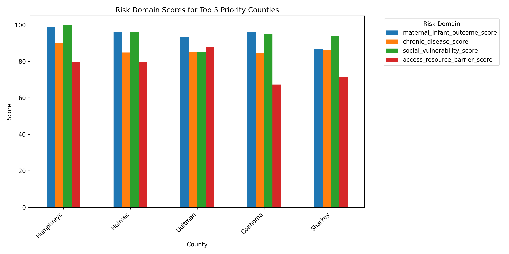
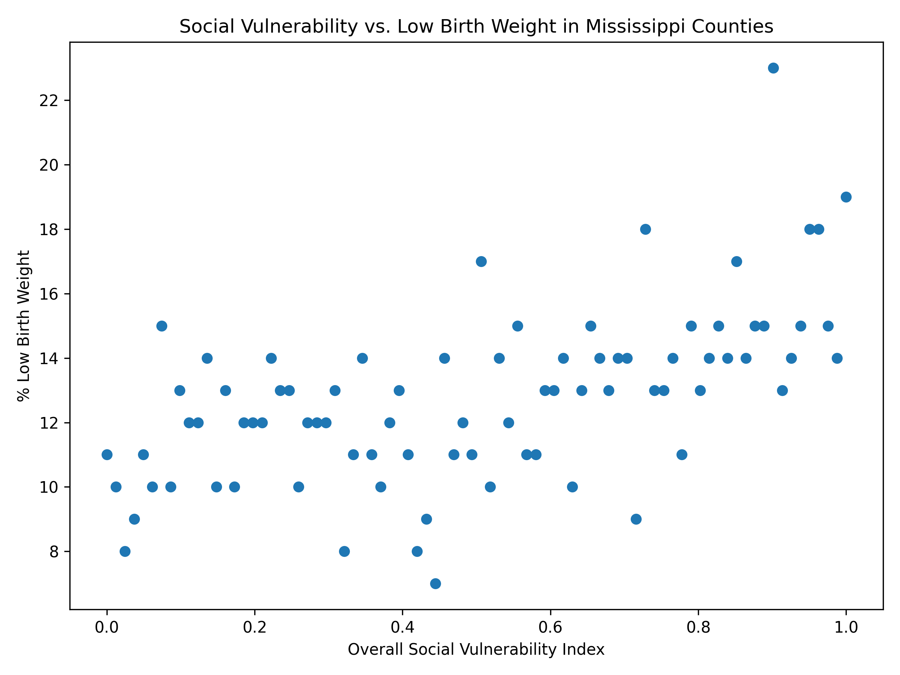
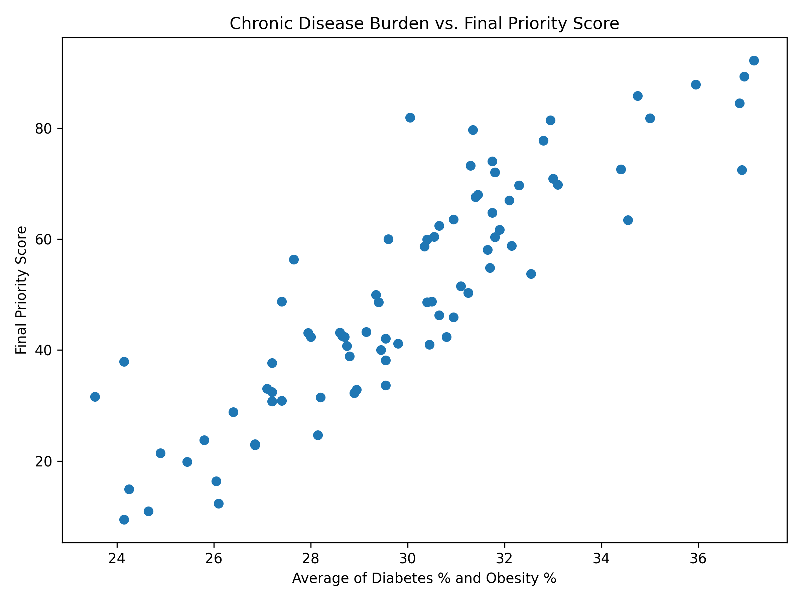

# Born at Risk  
## A Mississippi Maternal-Infant Health Priority Index

**Born at Risk** is a SQL-based public health data system that identifies Mississippi counties where maternal and infant health risks overlap with chronic disease burden, social vulnerability, and healthcare access barriers.

The project is designed as a decision-support tool for public health professionals, researchers, healthcare organizations, and community health leaders who need to understand where limited maternal and infant health resources may be needed first.

---

## Project Question

**Which Mississippi counties should be prioritized for maternal and infant health support based on overlapping public health risks?**

Instead of looking at one health measure alone, this project combines multiple public datasets into a structured SQL database and creates a county-level **Maternal-Infant Priority Score**.

---

## Why This Project Matters

Maternal and infant health outcomes are not shaped by one factor alone. A county may have poor infant outcomes, but the public health response also depends on broader conditions such as:

- chronic disease burden
- poverty and social vulnerability
- lack of insurance
- transportation barriers
- housing instability
- provider access
- child poverty

The goal of this project is **not** to predict individual medical risk. The goal is to identify counties where multiple risk factors overlap, so public health teams can better prioritize outreach, prevention, and resource allocation.

---

## Datasets Used

| Dataset | Purpose | Key Fields Used |
|---|---|---|
| CDC PLACES County Data, 2024 Release | County-level chronic disease and health burden | diabetes, obesity, high blood pressure, smoking, physical inactivity, poor physical health, poor mental health, depression, uninsured |
| CDC/ATSDR Social Vulnerability Index, Mississippi County Data | Social vulnerability and structural barriers | overall SVI, socioeconomic vulnerability, household vulnerability, housing/transportation vulnerability, poverty, no vehicle, no internet |
| County Health Rankings Mississippi 2025 | County-level infant outcome and access/resource indicators | low birth weight, uninsured, provider access, children in poverty, housing problems, food environment, broadband access, childcare cost burden |
| March of Dimes Mississippi Report Card | Background context and public health justification | preterm birth, infant mortality, maternal/infant health context |

All datasets were connected using county-level geographic identifiers such as **FIPS/GEOID**.

---

## Project Workflow

1. Selected public health datasets relevant to Mississippi maternal and infant health
2. Identified common join fields, especially county FIPS/GEOID
3. Cleaned and standardized raw datasets
4. Created cleaned CSV files for each dataset
5. Built a structured SQLite database
6. Loaded cleaned data into SQL tables
7. Created SQL queries to analyze county-level risk patterns
8. Built a transparent maternal-infant priority score
9. Created charts, maps, and an interactive visualization
10. Prepared presentation-ready outputs

---

## Database Design

The project uses a SQLite database called:

```text
born_at_risk_ms.db
```

The database contains these tables:

| Table | Description |
|---|---|
| `counties` | Basic county information including county FIPS, county name, population, and adult population |
| `places_health` | CDC PLACES health burden indicators |
| `social_vulnerability` | CDC/ATSDR SVI vulnerability indicators |
| `county_health_rankings` | County Health Rankings access, resource, and low birth weight indicators |
| `master_county_data` | Fully joined county-level dataset |
| `priority_scores` | Final domain scores, priority score, and priority level |

The database uses `county_fips` as the main join key across tables.

---

## Priority Score Method

The **Maternal-Infant Priority Score** ranks Mississippi counties from lower to higher priority based on overlapping risk domains.

The final score is based on four domains:

1. **Maternal/Infant Outcome Score**  
   Based on county-level low birth weight percentage.

2. **Chronic Disease Score**  
   Based on diabetes, obesity, high blood pressure, smoking, physical inactivity, poor physical health, poor mental health, and depression.

3. **Social Vulnerability Score**  
   Based on CDC/ATSDR overall Social Vulnerability Index.

4. **Access/Resource Barrier Score**  
   Based on uninsured rates, no vehicle access, children in poverty, severe housing problems, childcare cost burden, food environment, broadband access, and provider access.

Each domain is converted into a percentile-based score from 0 to 100.

```text
Final Priority Score =
(Maternal/Infant Outcome Score
+ Chronic Disease Score
+ Social Vulnerability Score
+ Access/Resource Barrier Score) / 4
```

Equal weighting was used to keep the prototype transparent and avoid unsupported assumptions about which domain should matter most. The score is meant to support public health decision-making, not replace expert judgment.

---

## Priority Levels

| Score Range | Priority Level |
|---|---|
| 80–100 | Critical Priority |
| 60–79 | High Priority |
| 40–59 | Moderate Priority |
| 0–39 | Lower Priority |

---

## Key Findings

The highest-priority counties identified by the index were:

1. Humphreys County  
2. Holmes County  
3. Quitman County  
4. Coahoma County  
5. Sharkey County  
6. Issaquena County  
7. Tunica County  
8. Leflore County  
9. Yazoo County  
10. Sunflower County  

These counties ranked high because multiple public health risks overlapped, including low birth weight, chronic disease burden, social vulnerability, and access/resource barriers.

---

## Example County Report Card

### Humphreys County

Humphreys County ranked as the highest-priority county in the index.

| Indicator | Value |
|---|---:|
| Final Priority Score | 92.22 |
| Priority Level | Critical Priority |
| Maternal/Infant Outcome Score | 98.78 |
| Chronic Disease Score | 90.24 |
| Social Vulnerability Score | 100.00 |
| Access/Resource Barrier Score | 79.85 |
| Low Birth Weight | 19% |
| Diabetes | 23.7% |
| Obesity | 50.6% |
| Uninsured | 14.3% |
| Children in Poverty | 47% |
| No Vehicle | 12.2% |

Humphreys County is not high priority because of one factor alone. It is high priority because multiple health and social risk domains overlap.

---

## Visualizations

### Mississippi County Priority Map



This map shows the final priority score by county. Darker counties have higher maternal-infant priority scores.

---

### Top 10 Priority Counties



This chart shows the counties with the highest final priority scores.

---

### Top 5 Domain Scores



This chart explains why the highest-ranked counties scored high by breaking the score into four risk domains.

---

### Social Vulnerability vs. Low Birth Weight



This scatterplot shows the relationship between social vulnerability and low birth weight across Mississippi counties.

---

### Chronic Disease Burden vs. Priority Score



This chart shows how chronic disease burden relates to the final priority score. Because chronic disease is one input into the score, this visualization is mainly used to explain how chronic disease contributes to the county ranking.

---

## Interactive Map

An interactive county map is included at:

```text
visuals/mississippi_priority_map_interactive.html
```

The interactive map allows users to hover over each Mississippi county and view:

- county name
- final priority score
- priority level

---

## Example SQL Query

The project includes SQL queries in:

```text
sql/analysis_queries.sql
```

Example query:

```sql
SELECT
    county_name,
    maternal_infant_outcome_score,
    chronic_disease_score,
    social_vulnerability_score,
    access_resource_barrier_score,
    final_priority_score,
    priority_level
FROM priority_scores
ORDER BY final_priority_score DESC
LIMIT 10;
```

This query identifies the top 10 highest-priority counties.

Additional SQL queries analyze:

- counties with high low birth weight
- counties with high social vulnerability
- counties with high chronic disease burden
- counties with access and resource barriers
- counties where multiple risks overlap

---

## Repository Structure

```text
born-at-risk-ms/
│
├── data_clean/
│   ├── places_clean.csv
│   ├── svi_clean.csv
│   ├── chr_clean.csv
│   ├── county_health_priority_base.csv
│   └── priority_scores.csv
│
├── data_raw/
│   └── raw dataset files are stored locally
│
├── sql/
│   └── analysis_queries.sql
│
├── src/
│   ├── clean_data.py
│   ├── build_database.py
│   ├── create_priority_scores.py
│   ├── create_visualizations.py
│   ├── create_priority_map.py
│   ├── create_interactive_priority_map.py
│   └── test_queries.py
│
├── visuals/
│   ├── mississippi_priority_map.png
│   ├── mississippi_priority_map_interactive.html
│   ├── top_10_priority_counties.png
│   ├── top_5_domain_scores.png
│   ├── svi_vs_low_birth_weight.png
│   ├── chronic_disease_vs_priority_score.png
│   └── highest_priority_county_report_card.txt
│
├── README.md
├── requirements.txt
├── .gitignore
└── born_at_risk_ms.db
```

---

## How to Run the Project

### 1. Install dependencies

```bash
pip install pandas geopandas matplotlib plotly
```

### 2. Clean raw datasets

```bash
python src/clean_data.py
```

This creates cleaned CSV files inside `data_clean/`.

### 3. Build the SQLite database

```bash
python src/build_database.py
```

This creates:

```text
born_at_risk_ms.db
```

### 4. Create priority scores

```bash
python src/create_priority_scores.py
```

This creates:

```text
data_clean/priority_scores.csv
```

and adds the `priority_scores` table to the database.

### 5. Run SQL query tests

```bash
python src/test_queries.py
```

### 6. Create visualizations

```bash
python src/create_visualizations.py
python src/create_priority_map.py
python src/create_interactive_priority_map.py
```

---

## Files Not Included

The U.S. Census county shapefile is not included because the `.shp` file exceeds GitHub's file size limit.

To recreate the map:

1. Download the U.S. Census TIGER/Line county shapefile.
2. Unzip it.
3. Place the folder here:

```text
data_raw/tl_2024_us_county/
```

The project expects this path:

```text
data_raw/tl_2024_us_county/tl_2024_us_county.shp
```

---

## Limitations

This project is a county-level decision-support prototype. It does not predict individual medical risk and should not be used as a clinical diagnosis tool.

The priority score depends on publicly available county-level indicators. Some measures may come from different years or estimation methods. Because of this, the score should be interpreted as a screening and prioritization tool, not a final policy decision.

Equal weighting was used for transparency. Future work could test alternative weighting methods, include more maternal health outcome variables, or validate the index with public health experts.

---

## How This Project Meets the Hackathon Requirements

| Requirement | How This Project Meets It |
|---|---|
| Data organization and database design | Cleaned three public datasets, standardized FIPS, designed SQLite tables, and created joined master data |
| SQL and data querying | Built SQL database and wrote queries for ranking, comparison, and risk overlap analysis |
| Analysis and insights | Identified Mississippi counties where maternal/infant risk overlaps with chronic disease, vulnerability, and access barriers |
| Visualization | Created bar charts, scatterplots, static county map, and interactive hover map |
| Presentation readiness | Outputs are designed for a 6-minute explanation to technical and non-technical audiences |
| Creativity and initiative | Created a custom Maternal-Infant Priority Index and county report card |
| Bonus considerations | Includes data cleaning workflow, SQL database, statistical scoring, interactive visualization, geographic map, and contextual analysis |

---

## Main Takeaway

**Born at Risk** shows that the counties most in need of maternal and infant health support are not defined by one issue alone. The highest-priority counties are places where infant outcome burden, chronic disease, social vulnerability, and access barriers overlap.

The project turns public health datasets into an actionable county-level priority system that can help guide outreach, prevention, and resource allocation in Mississippi.